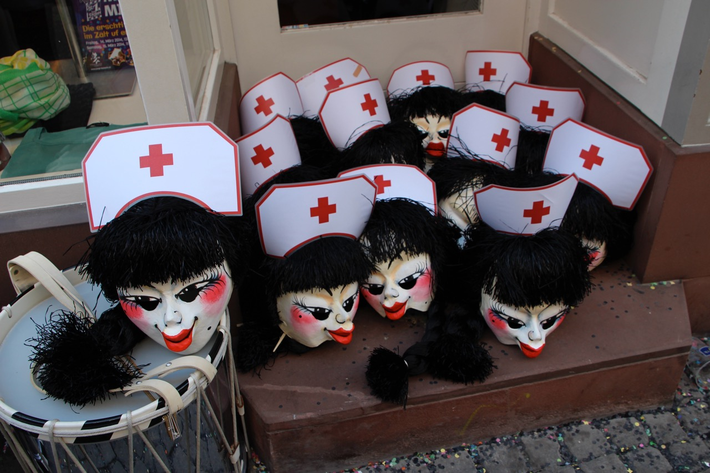

Mir sinn e Dambuure und Pfyffergrubbe mit aktuell 5 Pfyffer und 3 Dambuure. 
Am Mändig zoobe iebe mir am Wettsteiplatz vo 8 bis 10. An dr Fasnacht laufe mir zwar kai Cortège 
hänn aber trotzdäm meischtens e Sujet.

Mir sueche no Pfyffer, Drummler und Vordrääbler. Wenn de interessiert bisch, kasch di bi dr 
Sylvia (<a title="mailto:sylviakullmann@me.com?subject=Femmösli" 
href="mailto:sylviakullmann@me.com?subject=Femm%C3%B6sli">sylviakullmann@me.com</a>) mälde.

## Repertoire
### Pfyffer Märsch
- Dr 10. Värs
- Festival
- Arabi
- Regimäntsdochter
- S Hündli
- Hofnaar
- Z Basel
- Calvados
- Luuser
- Gässler
- Bajass
- Yankee
- Sam
- Let's go
- Altfrangg
- Ryslaifer
- Ohremyggeli
- Glopfgaischt
- Route
- Läggerli
- Glaibasler
- San Carlo
- Fritzli
- Auprès
- Sambre Meuse
- Retraite
- Saggodo
- Festspiel
- Whisky Soda
- Duudelsagg
- Pierrissimo
- Basler Marsch

### Drummel Märsch
- Mätzli
- Pumperniggel
- Ueli
- Winschdi
- Basel Nord
- Drummler
- Düsefäger
- Grien Hund
- Celanesen
- Strossefäger
- Faschtewaje

